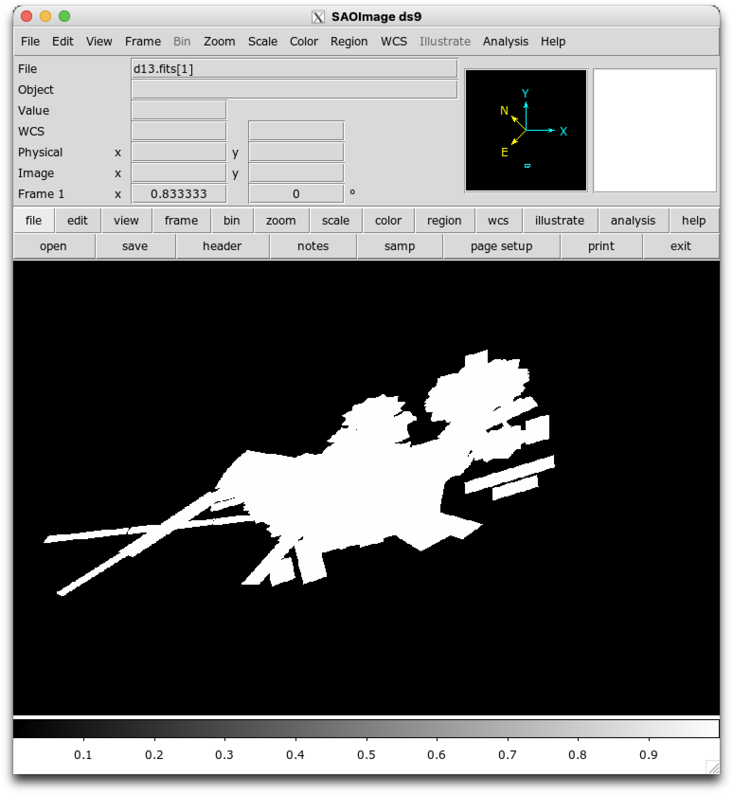
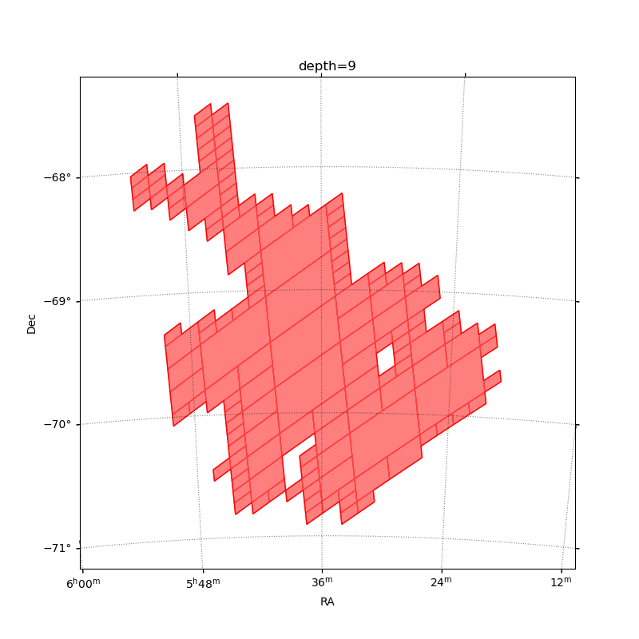
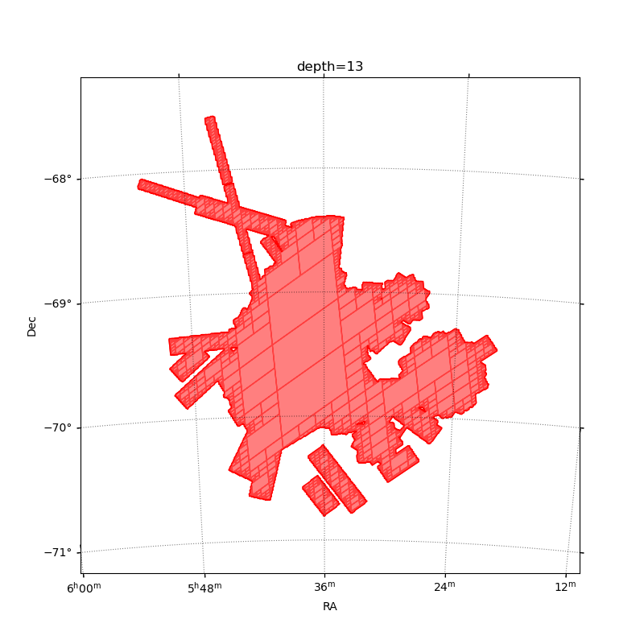

Can we provide a MOC for a selection of Chandra ObsIds?

The Chandra archive does provide a version of this:
https://cxc.harvard.edu/cda/cda_moc.html
but it is limiited in coverage (time).

The idea is to

- download the FOV files of the observations you want to include
- create a moc

This code has seen limited testing.

# Downloading FOV files

```
% ./find_chandra_fov ra dec radius outdir
```

    ra, dec, and radius are in decimal degrees
    outdir is created if it does not exist

This will create

    outdir/acisf????_???N???_fov1.fits.gz
    outdir/hrcf????_???N???_fov1.fits.gz

for observations within this cone.

If you have a different way to access this data then that can also
be used to create a directory of FOV files.

# Create the MOC

```
% ./make_chandra_moc indir outfile
    --depth 13
```

This uses all the files that match indir/*_fov1.fits.gz (so it needs the
gzip-compressed version because I was lazy when writing the script) and
will create the file outfile. The default depth is 13 (which is the value
used by the Chandra MOC produced by the archive).

# Area

Following
[Calculate a Smace-MOC sky area](https://cds-astro.github.io/mocpy/examples/user_documentation.html#calculating-a-space-moc-sky-area)

```
% ./moc_area d9.fits
4.56365919583572
% ./moc_area d13.fits
3.2207074012278123
```

# Visualization

The file view_chandra_moc.py takes some of the example code from
https://cds-astro.github.io/mocpy/_collections/notebooks/FITS-image-pixels-intersecting-MOC.html
to try and allow some visualization of the MOC.

DS9 8.8 beta 1 and later should be able to view MOCs but only if they
are written out as "pre_v2", which the code has been adjusted to do
(the `--v2` flag will turn this off).

```
% ds9 d13.fits
```



The `view_moc(infile, ra0, dec0, fov0, ...)` routine will display the MOC
using matplotlib (this requires that "pip install mocpy[plots]" has been
run, or the equivalent). This is very specific to the test case I used.

I ran a search for FOV files around SNR 1987A and the plots below compare
the depths of 9 and 13:

```
% ./find_chandra_fov 83.86661458 -69.26975194 1 fovs
...
% ./make_chandra_moc fovs d13.fits
...
% ./make_chandra_moc fovs d9.fits --depth 9
...
```

and then

```
> view_moc("d9.fits", fov0=4)
```



```
> view_moc("d13.fits", fov0=4)
```




# Overlaying on an image

You can try overlapping the MOC on an image - such as the output
of `flux_image` with something like:

```python
from astropy.wcs import WCS
from mocpy import MOC
from astropy.io import fits

hdus = fits.open("fimg/broad_flux.img")
wcs = WCS(header=hdus[0].header)
fig = plt.figure(figsize=(10, 10))
wcs = WCS(header=hdus[0].header)
ax = fig.add_subplot(1, 1, 1, projection=wcs)
im = ax.imshow(hdus[0].data, origin="lower", norm="log")

moc13 = MOC.load("single13.fits")
moc13.fill(ax=ax, wcs=wcs, alpha=0.3, color="red")
moc14 = MOC.load("single14.fits")
moc12 = MOC.load("single12.fits")
moc12.fill(ax=ax, wcs=wcs, alpha=0.2, color="orange")
moc14.fill(ax=ax, wcs=wcs, alpha=0.2, color="green")
```
